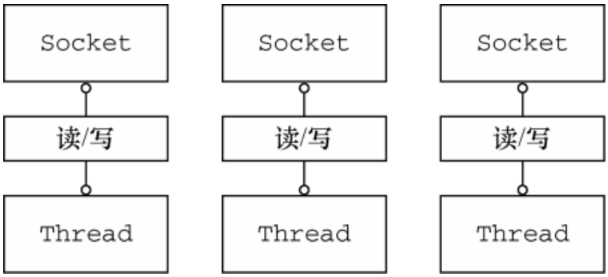

# Java BIO

BIO服务端需要管理多个并发客户端，需要为每个新的客户端Socket创建一个新的Thread

缺点：

1）任何时候都可能有大量的线程处于休眠状态，只是等待输入或输出数据就绪，可能算是一种资源浪费

2）需要为每个线程的调用栈分配内存，默认值的大小区间为64KB到1MB，具体取决于操作系统

3）JVM物理上可以支持非常大数量的线程，但是上下文切换会带来不少开销，例如在连接达到1w的时候，所以如果要支持10w或更大这种方式不理想