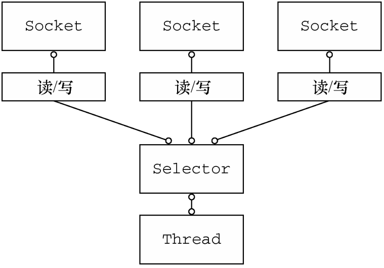

# Java NIO

JDK在2012Ian引入非阻塞I/O的支持，在JDK1.4的java.nio包中

上图展示了一个非阻塞设计，java.nio.channels.Seletor是Java的非阻塞IO实现的关键，使用了事件通知API以确定在一组非阻塞套接字中有哪些已经就绪可以进行IO相关的操作，这样就能一个线程处理多个并发的连接

好处：
1）少量线程便可以处理许多连接，减少内存管理和上下文切换所带来的开销
2）没有IO操作时，线程可以干别的任务

缺点：
1）高负载下可靠和高效地处理和调度IO操作是一项繁琐且易出错的任务（意思是JDK NIO不够好用）